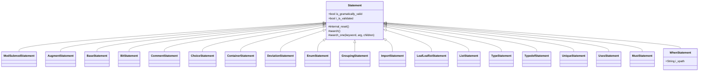

# pyang statements

```mermaid
classDiagram
    class Statement {
        +bool is_gramatically_valid
        +bool i_is_validated
        #internal_reset()
        #search()
        #search_one(keyword, arg, children)
    }
    Statement <|-- ModSubmodStatement
    Statement <|-- AugmentStatement
    Statement <|-- BaseStatement
    Statement <|-- BitStatement
    Statement <|-- CommentStatement
    Statement <|-- ChoiceStatement
    Statement <|-- ContainerStatement
    Statement <|-- DeviationStatement
    Statement <|-- EnumStatement
    Statement <|-- GroupingStatement
    Statement <|-- ImportStatement
    Statement <|-- LeafLeaflistStatement
    Statement <|-- ListStatement
    Statement <|-- TypeStatement
    Statement <|-- TypedefStatement
    Statement <|-- UniqueStatement
    Statement <|-- UsesStatement
    Statement <|-- MustStatement
    Statement <|-- WhenStatement
    class WhenStatement {
        +String i_xpath
    }
```

```mermaid
classDiagram

```
